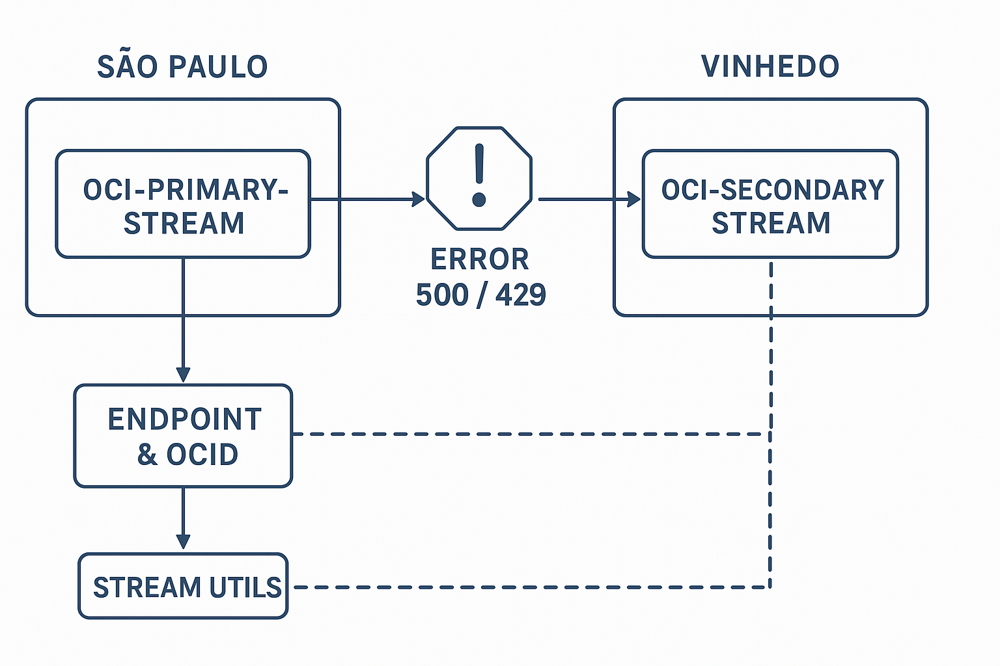

# OCI Streaming High Availability (HA) Failover Example

This repository contains a Java application demonstrating a **High Availability (HA) pattern** for consuming and producing messages to **Oracle Cloud Infrastructure (OCI) Streaming**.

The key objective is to provide resilience by implementing an automatic failover mechanism: if the primary OCI Stream in the São Paulo region experiences transient errors (HTTP 500 or 429), the application automatically **provisions and switches to a secondary stream** in the Vinhedo region.

## 🚀 Overview
  

                                                   ┌──────────────────────────────────────────────┐
                                                   │                LOCAL JAVA APPLICATION        │
                                                   │                                              │
                                                   │  ┌──────────────────┐  ┌──────────────────┐  │
                              (1) Initial Send ─────► │ StreamProducer/  │  │ StreamUtils      │  │
                                                   │ │ StreamManager (HA)│  │ (Persistence)    │  │
                                                   │  └──────────────────┘  └──────────────────┘  │
                                                   └──────────────────────────────────────────────┘
                                                                     │
                                                                     │ (2) Primary Attempt
                                                                     ▼
              ┌───────────────────────────────────────────────────────────────────────────────────────────┐
              │                  OCI REGION 1 – SÃO PAULO (Primary)                                       │
              │                                                                                           │
              │       ┌─────────────────────────────────────────────────────────────────┐                 │
     (3) Failure (500/429)◄───────│                 OCI-PRIMARY-STREAM                  │                 │
              │       └─────────────────────────────────────────────────────────────────┘                 │
              │                                                                                           │
              └───────────────────────────────────────────────────────────────────────────────────────────┘
                                                                     │
                                                                     │ (4) Failover Triggered!
                                                                     ▼
                                                   ┌──────────────────────────────────────────────┐
                                                   │ StreamManager (HA)                           │
                                                   │  - If Null: Creates Secondary Stream (Admin) │
                                                   │  - Saves OCID/Endpoint (via StreamUtils)     │
                                                   └──────────────────────────────────────────────┘
                                                                     │
                                                                     │ (5) Secondary Created / Switchover
                                                                     ▼
              ┌───────────────────────────────────────────────────────────────────────────────────────────┐
              │                  OCI REGION 2 – VINHEDO (Secondary)                                       │
              │                                                                                           │
              │       ┌─────────────────────────────────────────────────────────────────┐                 │
              │       │                 OCI-SECONDARY-STREAM (Dynamically Created)      │◄─────────────────┐
              │       └─────────────────────────────────────────────────────────────────┘                 ││
              │                                                                                           ││
              └───────────────────────────────────────────────────────────────────────────────────────────┘│
                                                                                                           │
                                                         (6) Secondary Producer & Consumer Traffic (Read/Write)

The solution is divided into four main Java classes and one configuration file:

| Class/File | Description | Role |
| :--- | :--- | :--- |
| `StreamProducer.java` | Initiates the producer and uses `StreamManager` to send messages with built-in HA logic. | **Producer Entry Point** |
| `StreamConsumer.java` | The consumer application. If consumption from the primary stream fails, it attempts to load the secondary stream details and switches consumption to the secondary stream. | **Consumer Entry Point** |
| `StreamManager.java` | **Core HA Logic.** Manages connection, retry attempts, error handling (500/429), and dynamically provisions the secondary stream in the alternate region (`sa-vinhedo-1`) upon primary failure. | **HA Logic / Provisioner** |
| `StreamUtils.java` | Utility class responsible for persisting and loading the secondary stream's OCID and endpoint to a local `.properties` file and exporting them as environment variables. | **Persistence / Environment** |
| `stream.properties` | Local file used by `StreamUtils` to save the secondary stream details. | **Configuration Store** |

-----

## 🏗️ Prerequisites

1.  **Java Development Kit (JDK) 11+**
2.  **Apache Maven** (for dependency management, though not explicitly shown in the code, it's assumed for an OCI project).
3.  **OCI Configuration File:** Authentication must be set up via the `~/.oci/config` file (or `C:\Users\Silvio\.oci\config` as shown in the code) with the correct `[DEFAULT]` profile.
4.  **IAM Policy:** The configured OCI User must have permissions to:
      * `STREAM_READ` on the Primary Stream.
      * `STREAM_WRITE` on the Primary Stream.
      * `STREAM_READ`, `STREAM_WRITE`, and `STREAM_ADMIN` (for creation) on the secondary **Compartment** in the target region (`sa-vinhedo-1`).

-----

## 📝 Key Configuration Variables

Before running, ensure the constants in your Java files match your OCI tenancy and resources:

| File | Variable | Description | Your Value |
| :--- | :--- | :--- | :--- |
| `StreamProducer.java` / `StreamConsumer.java` | `configPath`, `profile` | Local OCI CLI configuration path and profile name. | `C:\\Users\\Silvio\\.oci\\config`, `DEFAULT` |
| `StreamProducer.java` / `StreamConsumer.java` | `PRIMARY_STREAM_OCID` | OCID of your primary stream (São Paulo - `sa-saopaulo-1`). | `ocid1.stream...` |
| `StreamProducer.java` / `StreamConsumer.java` | `PRIMARY_ENDPOINT` | Message endpoint of your primary stream. | `https://cell-1.streaming...` |
| `StreamManager.java` | `COMPARTMENT_ID` | The OCID of the compartment where the secondary stream will be created. | `ocid1.compartment...` |
| `StreamManager.java` | `TARGET_REGION` | The secondary failover region. | `sa-vinhedo-1` |
| `StreamUtils.java` | `ABS_PATH` | The absolute path for the persistence file (`stream.properties`). | `C:\\Users\\Silvio\\...\\stream.properties` |

-----

## 💾 Core HA Logic (`StreamManager.java`)

The resilience logic is concentrated in the `StreamManager` class:

### 1\. Retry Mechanism

The `trySendWithRetries` method implements an exponential backoff retry logic.

```java
// Logic inside trySendWithRetries
// ...
// Calculate delay: 500ms * 2^attempt (e.g., 1s, 2s, 4s, 8s...)
int delay = (int) (BASE_DELAY_MS * Math.pow(2, attempt));
Thread.sleep(delay);
// ...
```

### 2\. Failover Trigger

Failover is triggered if the primary stream fails after exhausting all retry attempts.

```java
private boolean isRetryable(Exception ex) {
    if (ex instanceof BmcException) {
        int status = ((BmcException) ex).getStatusCode();
        // Trigger failover on common transient errors (5xx) or rate limiting (429)
        return status >= 500 || status == 429;
    } 
    // ... basic check for message content
}
```

### 3\. Dynamic Secondary Provisioning

If the secondary stream details are not loaded from the `stream.properties` file, the `createSecondaryStream` method is called.

  * It uses the **StreamAdminClient** and explicitly sets the region to `sa-vinhedo-1` (via `StreamAdminClient.builder().region(TARGET_REGION)`).
  * Upon successful creation, it calls `StreamUtils.saveSecondaryStream` to persist the new OCID and endpoint and updates the environment variable for consumption.

-----

## 📥 Consumer Failover (`StreamConsumer.java`)

The consumer continuously tries to read messages.

1.  **Initial State:** Consumes from `primaryClient`.
2.  **Error Handling:** If `consumeOnce` throws an exception, the `catch` block attempts to load the secondary stream details (`secEndpoint`, `secOcid`) using `StreamUtils`.
3.  **Switchover:** If secondary details are found, the `currentClient` is switched to the `secondaryClient`, a new cursor is created for the secondary stream (`TrimHorizon`), and consumption continues on the new stream.

This design ensures that if the primary stream fails (due to capacity, regional outage, etc.), the application quickly **provisions an isolated resource in a separate region** and switches both the producer and consumer traffic to it, maintaining high availability.
