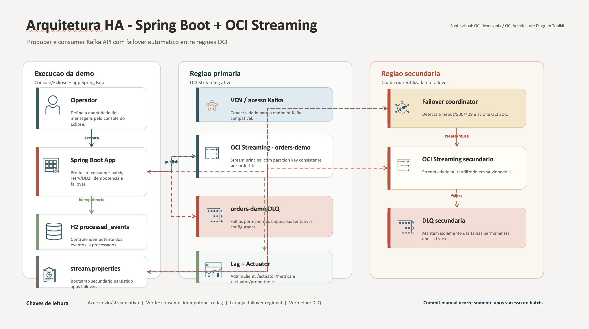
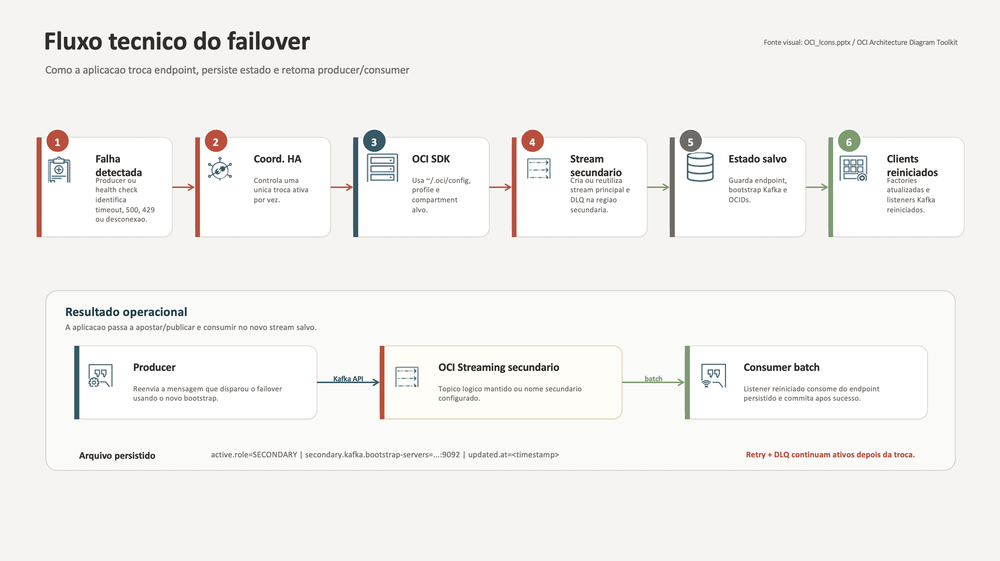

# OCI Streaming High Availability (HA) Failover Example

Aplicacao Spring Boot de demonstracao para producer e consumer usando a API Kafka compativel com Oracle Cloud Infrastructure (OCI) Streaming.

O projeto foi criado para executar no Eclipse, validar comportamentos pelo console e demonstrar praticas importantes de consumo de eventos: chave de particao consistente, consumer idempotente, commit manual apos sucesso, retry com DLQ, monitoramento de lag, cooperative sticky rebalance, processamento em lote e failover automatico para outro stream em outra regiao.

## Sumario

- [Objetivo](#objetivo)
- [Arquitetura](#arquitetura)
- [Pre-requisitos](#pre-requisitos)
- [Configuracao rapida](#configuracao-rapida)
- [Executando no Eclipse](#executando-no-eclipse)
- [Configuracao para OCI Streaming](#configuracao-para-oci-streaming)
- [Failover regional](#failover-regional)
- [Variaveis de configuracao](#variaveis-de-configuracao)
- [Testes pelo console](#testes-pelo-console)
- [Praticas implementadas](#praticas-implementadas)
- [Observabilidade](#observabilidade)
- [Estrutura do projeto](#estrutura-do-projeto)
- [Troubleshooting](#troubleshooting)
- [Seguranca](#seguranca)

## Objetivo

Esta aplicacao simula um fluxo de pedidos publicado em um stream Kafka/OCI Streaming e consumido em batch.

O produtor publica eventos `OrderEvent` no topico principal. O consumer processa os registros em lote, grava controle de idempotencia em H2, confirma o offset somente depois do processamento com sucesso e envia mensagens com falha permanente para uma DLQ depois das tentativas configuradas.

Quando o failover esta habilitado, a aplicacao tambem consegue reagir a uma falha do stream ativo. Ela cria ou reutiliza um stream equivalente em uma regiao secundaria, grava o novo endpoint em arquivo e passa a publicar e consumir usando o novo bootstrap Kafka.

## Arquitetura

Os desenhos abaixo usam os icones do OCI Architecture Diagram Toolkit e representam a versao visual da arquitetura da demonstracao. Tambem ha uma versao em PowerPoint para edicao: [`OCI_Streaming_HA_Architecture.pptx`](OCI_Streaming_HA_Architecture.pptx).

### Desenho High Level



### Desenho Tecnico Aprofundado



## Pre-requisitos

- JDK 8 ou superior.
- Maven 3.8 ou superior.
- Eclipse com suporte a Maven (`Existing Maven Project`).
- Kafka local, Docker Kafka ou OCI Streaming.
- Para OCI Streaming:
  - Usuario OCI com Auth Token.
  - Stream Pool com endpoint Kafka disponivel.
  - Streams criados para o ambiente primario ou permissao para criar/reutilizar streams no failover.
  - Arquivo `~/.oci/config` valido quando o failover precisar criar ou localizar streams na regiao secundaria.
  - Politicas IAM permitindo usar e, se aplicavel, gerenciar streams no compartment.

## Configuracao rapida

### Kafka local

Com um Kafka local em `localhost:9092`, os defaults ja funcionam:

```bash
mvn spring-boot:run
```

Para pedir uma quantidade fixa de mensagens sem prompt interativo:

```bash
mvn spring-boot:run -Dspring-boot.run.arguments="--demo.producer.interactive=false --demo.producer.message-count=20"
```

Se quiser que a aplicacao tente criar os topicos no Kafka local:

```bash
mvn spring-boot:run -Dspring-boot.run.arguments="--demo.topics.create=true"
```

### OCI Streaming sem failover

Configure o profile `oci` e informe o bootstrap Kafka do Stream Pool:

```bash
export SPRING_PROFILES_ACTIVE=oci
export OCI_STREAMING_BOOTSTRAP_SERVERS="<stream-pool-endpoint>:9092"
export OCI_STREAMING_SASL_JAAS_CONFIG='org.apache.kafka.common.security.plain.PlainLoginModule required username="<tenancy-name>/<user-name>/<stream-pool-ocid>" password="<auth-token>";'
export DEMO_TOPIC_ORDERS="orders-demo"
export DEMO_TOPIC_ORDERS_DLQ="orders-demo.DLQ"

mvn spring-boot:run
```

No OCI Streaming, cada stream funciona como um topico Kafka. Crie previamente o stream principal e o stream de DLQ, ou habilite a criacao somente quando estiver usando Kafka local.

## Executando no Eclipse

1. Abra o Eclipse.
2. Selecione `File > Import > Existing Maven Projects`.
3. Escolha a pasta deste repositorio.
4. Aguarde o Maven resolver as dependencias.
5. Abra a classe `br.com.demo.ocistreaming.OciStreamingDemoApplication`.
6. Execute como `Java Application` ou `Spring Boot App`.
7. Configure as variaveis de ambiente em `Run Configurations > Environment`.
8. Configure argumentos em `Run Configurations > Arguments > Program arguments`.

Exemplo de `Program arguments`:

```text
--demo.producer.interactive=false --demo.producer.message-count=50 --demo.consumer.batch-size=10
```

Quando `demo.producer.interactive=true`, o console mostra:

```text
Quantidade de mensagens para produzir [10]:
```

Informe a quantidade desejada e pressione Enter.

## Configuracao para OCI Streaming

### 1. Criar streams

Crie dois streams no OCI Streaming:

| Stream | Uso | Exemplo |
| --- | --- | --- |
| Principal | Recebe eventos de pedido | `orders-demo` |
| DLQ | Recebe eventos que falharam depois dos retries | `orders-demo.DLQ` |

Use uma quantidade de particoes coerente com o paralelismo esperado. A chave Kafka usada neste projeto e `orderId`, entao todos os eventos do mesmo pedido ficam na mesma particao e preservam ordem por entidade.

### 2. Configurar autenticacao Kafka

O profile `oci` ajusta:

```text
security.protocol=SASL_SSL
sasl.mechanism=PLAIN
```

Informe o JAAS config pelo ambiente:

```bash
export OCI_STREAMING_SASL_JAAS_CONFIG='org.apache.kafka.common.security.plain.PlainLoginModule required username="<tenancy-name>/<user-name>/<stream-pool-ocid>" password="<auth-token>";'
```

O formato exato do `username` deve seguir a configuracao Kafka compativel do seu Stream Pool. Em ambientes OCI, normalmente ele inclui tenancy, usuario e OCID do Stream Pool. O `password` e o Auth Token do usuario, nao a senha de login da Console OCI.

### 3. Informar endpoint e topicos

```bash
export OCI_STREAMING_BOOTSTRAP_SERVERS="<stream-pool-endpoint>:9092"
export DEMO_TOPIC_ORDERS="orders-demo"
export DEMO_TOPIC_ORDERS_DLQ="orders-demo.DLQ"
```

O endpoint geralmente tem formato parecido com:

```text
cell-1.streaming.<region>.oci.oraclecloud.com:9092
```

### 4. Executar

```bash
export SPRING_PROFILES_ACTIVE=oci
mvn spring-boot:run
```

## Failover regional

O failover regional foi inspirado no exemplo `SilvioCristiano/Resilient-HA-OCI-Streaming`.

Quando `DEMO_FAILOVER_ENABLED=true`, a aplicacao pode migrar do stream ativo para um stream em outra regiao quando uma falha compativel com indisponibilidade/transiencia e detectada. Exemplos: timeout, desconexao, erro HTTP 500 ou erro HTTP 429.

### Fluxo do failover

1. O producer ou o health check detecta falha no endpoint ativo.
2. `StreamingFailoverCoordinator` coordena uma unica troca ativa por vez.
3. `OciStreamProvisioner` usa o OCI SDK e o arquivo `~/.oci/config`.
4. A aplicacao cria ou reutiliza o stream principal secundario e a DLQ secundaria.
5. O endpoint de mensagens OCI e convertido para bootstrap Kafka usando a porta configurada, por default `9092`.
6. `StreamingFailoverStateStore` salva o estado em `./data/stream.properties`.
7. `ActiveStreamingTargetResolver` passa a resolver producer e consumer para o endpoint secundario.
8. `KafkaClientSwitchService` reinicia os listeners Kafka para consumir do novo stream.
9. O producer tenta reenviar a mensagem que disparou o failover.

### Configuracao minima de failover

```bash
export SPRING_PROFILES_ACTIVE=oci
export DEMO_FAILOVER_ENABLED=true
export DEMO_FAILOVER_COMPARTMENT_ID="<ocid1.compartment...>"
export DEMO_FAILOVER_TARGET_REGION="sa-vinhedo-1"
export DEMO_OCI_CONFIG_PATH="$HOME/.oci/config"
export DEMO_OCI_PROFILE="DEFAULT"
```

Se os nomes secundarios nao forem informados, a aplicacao usa os mesmos nomes dos topicos primarios:

```bash
export DEMO_FAILOVER_SECONDARY_STREAM_NAME="orders-demo"
export DEMO_FAILOVER_SECONDARY_DLQ_STREAM_NAME="orders-demo.DLQ"
```

Se o Stream Pool secundario exigir outra credencial SASL, configure:

```bash
export DEMO_FAILOVER_SECONDARY_SASL_JAAS_CONFIG='org.apache.kafka.common.security.plain.PlainLoginModule required username="<tenancy-name>/<user-name>/<secondary-stream-pool-ocid>" password="<auth-token>";'
```

Tambem e possivel informar diretamente o bootstrap secundario se voce ja conhece o endpoint:

```bash
export DEMO_FAILOVER_SECONDARY_BOOTSTRAP_SERVERS="cell-1.streaming.sa-vinhedo-1.oci.oraclecloud.com:9092"
```

### Arquivo de estado do failover

Por default, o estado ativo fica em:

```text
./data/stream.properties
```

Exemplo:

```properties
# Active OCI Streaming failover target
active.role=SECONDARY
active.region=sa-vinhedo-1
active.topic.orders=orders-demo
active.topic.orders-dlq=orders-demo.DLQ
secondary.stream.ocid=ocid1.stream.oc1...
secondary.dlq-stream.ocid=ocid1.stream.oc1...
secondary.messages.endpoint=https://cell-1.streaming.sa-vinhedo-1.oci.oraclecloud.com
secondary.kafka.bootstrap-servers=cell-1.streaming.sa-vinhedo-1.oci.oraclecloud.com:9092
updated.at=2026-07-21T12:00:00Z
```

Na proxima inicializacao, se `DEMO_FAILOVER_ENABLED=true` e `DEMO_FAILOVER_ACTIVATE_PERSISTED_SECONDARY=true`, a aplicacao carrega esse arquivo e ja inicia publicando e consumindo no endpoint secundario salvo.

Para forcar retorno ao primario em uma demonstracao, pare a aplicacao e remova `./data/stream.properties` ou configure:

```bash
export DEMO_FAILOVER_ACTIVATE_PERSISTED_SECONDARY=false
```

## Variaveis de configuracao

### Kafka e topicos

| Variavel | Default | Descricao |
| --- | --- | --- |
| `SPRING_PROFILES_ACTIVE` | vazio | Use `oci` para habilitar defaults de SASL_SSL/PLAIN. |
| `OCI_STREAMING_BOOTSTRAP_SERVERS` | `localhost:9092` | Bootstrap Kafka ativo. No OCI, use endpoint do Stream Pool com porta `9092`. |
| `OCI_STREAMING_SECURITY_PROTOCOL` | `PLAINTEXT` (`SASL_SSL` no profile `oci`) | Protocolo de seguranca Kafka. |
| `OCI_STREAMING_SASL_MECHANISM` | vazio (`PLAIN` no profile `oci`) | Mecanismo SASL. |
| `OCI_STREAMING_SASL_JAAS_CONFIG` | vazio | JAAS config com username e Auth Token. |
| `DEMO_KAFKA_CLIENT_ID` | `spring-boot-oci-streaming-demo` | Client ID usado pelos clients Kafka. |
| `DEMO_CONSUMER_GROUP` | `oci-streaming-demo-consumer` | Consumer group. Troque para reprocessar desde `earliest`. |
| `DEMO_TOPIC_ORDERS` | `orders-demo` | Stream/topico principal. |
| `DEMO_TOPIC_ORDERS_DLQ` | `orders-demo.DLQ` | Stream/topico de DLQ. |
| `DEMO_TOPICS_CREATE` | `false` | Cria topicos via Kafka Admin. Recomendado apenas para Kafka local. |
| `DEMO_TOPICS_PARTITIONS` | `3` | Particoes usadas ao criar topicos localmente ou no failover quando `DEMO_FAILOVER_PARTITIONS=0`. |
| `DEMO_TOPICS_REPLICATION_FACTOR` | `1` | Replication factor para criacao de topicos em Kafka local. |

### Producer

| Variavel | Default | Descricao |
| --- | --- | --- |
| `DEMO_PRODUCER_ENABLED` | `true` | Liga/desliga o producer automatico. |
| `DEMO_PRODUCER_INTERACTIVE` | `true` | Quando `true`, pergunta a quantidade no console. |
| `DEMO_PRODUCER_MESSAGE_COUNT` | `10` | Quantidade padrao quando nao ha entrada interativa. |
| `DEMO_PRODUCER_DELAY_MS` | `150` | Intervalo entre envios. |
| `DEMO_PRODUCER_START_SEQUENCE` | `1` | Sequencia inicial usada para gerar eventos deterministicos. |
| `DEMO_PRODUCER_ORDER_POOL_SIZE` | `5` | Quantidade de `orderId` diferentes. Controla distribuicao por chave. |
| `DEMO_PRODUCER_POISON_EVERY` | `0` | A cada N mensagens gera evento de falha permanente. `0` desliga. |
| `DEMO_PRODUCER_TRANSIENT_EVERY` | `0` | A cada N mensagens gera evento de falha temporaria. `0` desliga. |
| `DEMO_PRODUCER_DETERMINISTIC_EVENT_IDS` | `true` | Permite repetir execucoes com os mesmos `eventId` para testar idempotencia. |

### Consumer

| Variavel | Default | Descricao |
| --- | --- | --- |
| `DEMO_CONSUMER_ENABLED` | `true` | Liga/desliga o consumer. |
| `DEMO_CONSUMER_CONCURRENCY` | `1` | Numero de threads/listeners. Nao deve superar sem necessidade a quantidade de particoes. |
| `DEMO_CONSUMER_BATCH_SIZE` | `10` | Tamanho maximo do lote por poll. |
| `DEMO_CONSUMER_SIMULATED_WORK_MS` | `100` | Tempo artificial de processamento por evento. |
| `DEMO_CONSUMER_RETRY_BACKOFF_MS` | `1000` | Intervalo entre tentativas do error handler. |
| `DEMO_CONSUMER_RETRY_ATTEMPTS` | `3` | Quantidade de tentativas antes de enviar para DLQ. |
| `DEMO_CONSUMER_TRANSIENT_FAILURES_BEFORE_SUCCESS` | `2` | Numero de falhas temporarias simuladas antes do sucesso. |
| `DEMO_LAG_MONITOR_ENABLED` | `true` | Liga/desliga log periodico de lag. |
| `DEMO_LAG_MONITOR_INTERVAL_MS` | `15000` | Intervalo do monitoramento de lag. |

### Failover

| Variavel | Default | Descricao |
| --- | --- | --- |
| `DEMO_FAILOVER_ENABLED` | `false` | Liga o failover regional. |
| `DEMO_FAILOVER_HEALTH_CHECK_ENABLED` | `true` | Liga health check periodico do endpoint ativo. |
| `DEMO_FAILOVER_ACTIVATE_PERSISTED_SECONDARY` | `true` | Ao iniciar, usa o secundario salvo em `stream.properties` se existir. |
| `DEMO_FAILOVER_CREATE_STREAMS` | `true` | Cria stream secundario se nao existir. Se `false`, exige stream existente. |
| `DEMO_FAILOVER_CREATE_DLQ` | `true` | Cria/reutiliza DLQ secundaria. |
| `DEMO_FAILOVER_STATE_FILE` | `./data/stream.properties` | Arquivo com endpoint ativo depois do failover. |
| `DEMO_OCI_CONFIG_PATH` | `$HOME/.oci/config` | Arquivo de configuracao OCI usado pelo SDK. |
| `DEMO_OCI_PROFILE` | `DEFAULT` | Profile OCI usado pelo SDK. |
| `DEMO_FAILOVER_COMPARTMENT_ID` | vazio | Compartment onde os streams secundarios serao criados/localizados. Obrigatorio para failover. |
| `DEMO_FAILOVER_TARGET_REGION` | `sa-vinhedo-1` | Regiao secundaria. |
| `DEMO_FAILOVER_SECONDARY_STREAM_NAME` | vazio | Nome do stream secundario. Vazio usa `DEMO_TOPIC_ORDERS`. |
| `DEMO_FAILOVER_SECONDARY_DLQ_STREAM_NAME` | vazio | Nome da DLQ secundaria. Vazio usa `DEMO_TOPIC_ORDERS_DLQ`. |
| `DEMO_FAILOVER_SECONDARY_BOOTSTRAP_SERVERS` | vazio | Bootstrap secundario manual. Se vazio, a aplicacao deriva do endpoint OCI. |
| `DEMO_FAILOVER_SECONDARY_SECURITY_PROTOCOL` | vazio | Sobrescreve protocolo Kafka do secundario. No profile `oci`, herda `SASL_SSL`. |
| `DEMO_FAILOVER_SECONDARY_SASL_MECHANISM` | vazio | Sobrescreve mecanismo SASL do secundario. No profile `oci`, herda `PLAIN`. |
| `DEMO_FAILOVER_SECONDARY_SASL_JAAS_CONFIG` | vazio | JAAS config especifica do Stream Pool secundario. |
| `DEMO_FAILOVER_PARTITIONS` | `0` | Particoes para streams secundarios. `0` usa `DEMO_TOPICS_PARTITIONS`. |
| `DEMO_FAILOVER_KAFKA_BOOTSTRAP_PORT` | `9092` | Porta usada ao converter endpoint OCI para bootstrap Kafka. |
| `DEMO_FAILOVER_ADMIN_MAX_WAIT_SECONDS` | `120` | Tempo maximo aguardando stream ficar ativo. |
| `DEMO_FAILOVER_ADMIN_POLL_INTERVAL_SECONDS` | `5` | Intervalo entre consultas ao OCI durante criacao/reuso. |
| `DEMO_FAILOVER_HEALTH_CHECK_INTERVAL_MS` | `15000` | Intervalo do health check. |
| `DEMO_FAILOVER_HEALTH_CHECK_TIMEOUT_MS` | `5000` | Timeout do health check. |

## Testes pelo console

### Enviar 50 mensagens

```text
--demo.producer.interactive=false --demo.producer.message-count=50
```

### Validar idempotencia

Execute duas vezes com os mesmos argumentos:

```text
--demo.producer.interactive=false --demo.producer.message-count=10 --demo.producer.start-sequence=1
```

Como `demo.producer.use-deterministic-event-ids=true`, os mesmos `eventId` serao gerados. Na segunda execucao, o consumer identifica que os eventos ja foram processados e ignora duplicidades.

### Validar retry e DLQ

Gera um evento permanente a cada 5 mensagens:

```text
--demo.producer.interactive=false --demo.producer.message-count=15 --demo.producer.poison-every=5 --demo.consumer.retry-attempts=2
```

Depois dos retries, esses registros sao publicados na DLQ configurada em `DEMO_TOPIC_ORDERS_DLQ`.

### Validar falha temporaria

Gera eventos temporarios a cada 3 mensagens:

```text
--demo.producer.interactive=false --demo.producer.message-count=10 --demo.producer.transient-every=3 --demo.consumer.transient-failures-before-success=2
```

O consumer falha temporariamente e depois conclui com sucesso dentro das tentativas configuradas.

### Validar batch e paralelismo

```text
--demo.consumer.batch-size=25 --demo.consumer.concurrency=3
```

O ganho de paralelismo depende da quantidade de particoes e da distribuicao da chave `orderId`.

### Validar failover

1. Execute com `SPRING_PROFILES_ACTIVE=oci` e `DEMO_FAILOVER_ENABLED=true`.
2. Interrompa ou invalide temporariamente o endpoint primario.
3. Aguarde o producer ou health check detectar a falha.
4. Verifique no log a troca para `SECONDARY`.
5. Confira `./data/stream.properties`.
6. Reinicie a aplicacao e confirme que ela inicia no endpoint secundario salvo.

## Praticas implementadas

| Pratica | Objetivo | Implementacao |
| --- | --- | --- |
| Partition Key Consistente | Garantir ordem por entidade e distribuir carga | `OrderEvent.partitionKey()` usa `orderId` como chave Kafka. |
| Consumer Idempotente | Permitir reprocessamento sem duplicidade | `JdbcProcessedEventRepository` grava `event_id` como chave primaria em `processed_events`. |
| Commit Apos Sucesso | Evitar perda de mensagens | `OrderEventBatchConsumer` chama `Acknowledgment.acknowledge()` somente apos processar o batch. |
| Retry + DLQ | Separar falhas temporarias de permanentes | `KafkaDemoConfig` usa `DefaultErrorHandler`, `FixedBackOff` e `DeadLetterPublishingRecoverer`. |
| Monitoramento de Lag | Detectar atraso no consumo | `ConsumerLagMonitor` consulta offsets commitados e finais via `AdminClient`. |
| Cooperative Sticky Rebalance | Reduzir impacto de rebalance | `partition.assignment.strategy=CooperativeStickyAssignor`. |
| Batch Processing | Aumentar throughput | Listener em batch com `ConcurrentKafkaListenerContainerFactory#setBatchListener(true)`. |
| HA Failover Regional | Trocar endpoint e stream em falha regional | Pacote `ha` cria/reutiliza stream secundario, persiste estado e reinicia consumers. |

## Observabilidade

O lag e registrado periodicamente no console com grupo, topico, particao, offset commitado, offset final e lag total.

Endpoints Actuator habilitados:

```text
/actuator/health
/actuator/metrics
/actuator/prometheus
```

Com Prometheus, colete:

```text
http://localhost:8080/actuator/prometheus
```

O banco H2 fica em:

```text
./data/processed-events
```

Para repetir uma demonstracao sem historico de idempotencia, pare a aplicacao e remova os arquivos em `./data`.

## Estrutura do projeto

```text
src/main/java/br/com/demo/ocistreaming
  OciStreamingDemoApplication.java
  config/
    KafkaDemoConfig.java
    KafkaClientPropertiesFactory.java
    StreamingDemoProperties.java
  consumer/
    OrderEventBatchConsumer.java
    OrderEventProcessor.java
    JdbcProcessedEventRepository.java
  domain/
    OrderEvent.java
  ha/
    ActiveStreamingTargetResolver.java
    KafkaClientSwitchService.java
    OciStreamProvisioner.java
    StreamingEndpointState.java
    StreamingFailoverCoordinator.java
    StreamingFailoverHealthMonitor.java
    StreamingFailoverStateStore.java
  monitoring/
    ConsumerLagMonitor.java
  producer/
    DemoOrderEventFactory.java
    DemoProducerRunner.java
    FailoverAwareOrderProducer.java

src/main/resources
  application.yml
  application-oci.yml
  schema.sql
```

## Troubleshooting

| Sintoma | Causa provavel | Acao recomendada |
| --- | --- | --- |
| `TimeoutException` ao produzir | Bootstrap incorreto, stream indisponivel ou rede bloqueada | Verifique `OCI_STREAMING_BOOTSTRAP_SERVERS`, porta `9092`, DNS e acesso de rede. |
| `SaslAuthenticationException` | JAAS config, Auth Token ou Stream Pool OCID incorreto | Gere novo Auth Token e revise `OCI_STREAMING_SASL_JAAS_CONFIG`. |
| Consumer nao recebe mensagens | Topico errado, consumer group ja commitado ou producer desabilitado | Confira `DEMO_TOPIC_ORDERS`, troque `DEMO_CONSUMER_GROUP` ou habilite producer. |
| Mensagens duplicadas no log | Commit manual pode repetir apos falha antes do commit | Isso e esperado; a tabela `processed_events` evita duplicidade de processamento. |
| Eventos vao para DLQ | Falha permanente simulada ou retries insuficientes | Ajuste `DEMO_PRODUCER_POISON_EVERY`, `DEMO_CONSUMER_RETRY_ATTEMPTS` e leia a DLQ. |
| Failover nao cria stream | Falta compartment, policy IAM ou OCI config | Verifique `DEMO_FAILOVER_COMPARTMENT_ID`, `DEMO_OCI_CONFIG_PATH`, `DEMO_OCI_PROFILE` e permissoes. |
| Aplicacao inicia no secundario sem querer | `stream.properties` persistido | Remova `./data/stream.properties` ou use `DEMO_FAILOVER_ACTIVATE_PERSISTED_SECONDARY=false`. |
| Lag sempre zero | Nao ha backlog ou offsets ainda nao existem | Produza mais mensagens, confirme o group id e veja se o consumer esta ativo. |

## Seguranca

- Nao versionar Auth Tokens, OCIDs sensiveis, arquivos `~/.oci/config` ou `stream.properties` reais de ambiente.
- A pasta `data/` esta no `.gitignore` para evitar publicar banco H2 e estado de failover.
- Prefira variaveis de ambiente ou secret manager para valores de SASL/JAAS.
- Use policies IAM com menor privilegio necessario. Para failover com criacao automatica, a aplicacao precisa permissao para gerenciar streams no compartment secundario.

## Comandos uteis

Rodar testes:

```bash
mvn test
```

Rodar aplicacao:

```bash
mvn spring-boot:run
```

Rodar com profile OCI:

```bash
SPRING_PROFILES_ACTIVE=oci mvn spring-boot:run
```

Gerar pacote:

```bash
mvn clean package
```
